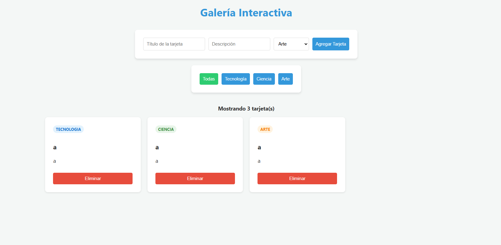

# Galería Interactiva — U4

## Descripción del Proyecto

Este proyecto es una **Galería Interactiva** que permite a los usuarios gestionar tarjetas de contenido de forma dinámica. Los usuarios pueden agregar nuevas tarjetas con un título, descripción y categoría (Tecnología, Ciencia o Arte), filtrarlas por categorías y eliminarlas. La aplicación demuestra el uso de manipulación del DOM, manejo de eventos y estado local en JavaScript.

## Capturas de Pantalla


*Interfaz principal de la galería con el formulario de creación y filtros.*

## Tecnologías Utilizadas

* **HTML5**: Estructura semántica del contenido.
* **CSS3**: Estilización y diseño responsivo.
* **JavaScript (ES6+)**: Lógica de la aplicación, manipulación del DOM y gestión de eventos.

## Instrucciones de Ejecución

Sigue estos pasos para ejecutar el proyecto localmente:

1. **Clonar el repositorio** (o descargar los archivos):

    ```bash
    git clone https://github.com/tu-usuario/daza-post1-u4.git
    ```

2. **Navegar a la carpeta del proyecto**:

    ```bash
    cd daza-post1-u4
    ```

3. **Abrir el proyecto**:
    * Simplemente abre el archivo [index.html](index.html) en tu navegador web favorito.
    * Alternativamente, si usas VS Code, puedes usar la extensión **Live Server** para una mejor experiencia de desarrollo.

---
Proyecto desarrollado para la Unidad 4.
